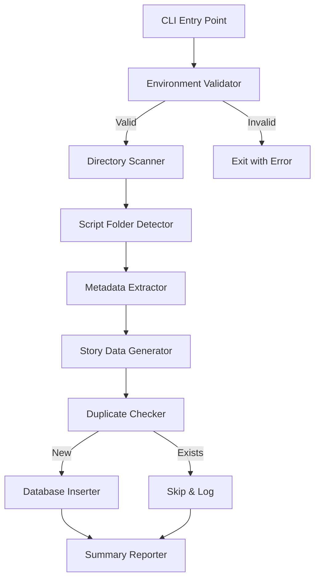

# Design Document: Local Script Import

## Overview

This feature provides a command-line utility to scan local script folders (剧本杀 scripts) from the project root directory and import them into the Supabase `stories` table. The import script extracts metadata from folder structures, generates proper JSON data structures, handles duplicates, and assigns sensible defaults for missing information.

## Architecture



### Component Flow

1. **CLI Entry Point**: Validates environment and initiates the import process
2. **Directory Scanner**: Scans root directory for potential script folders
3. **Script Folder Detector**: Identifies valid script folders by checking for characteristic subfolders
4. **Metadata Extractor**: Parses folder names for title, player count, and other metadata
5. **Story Data Generator**: Creates the `story_data` JSON structure with characters, clues, and assets
6. **Duplicate Checker**: Queries database to check if script already exists
7. **Database Inserter**: Inserts new scripts into the `stories` table
8. **Summary Reporter**: Outputs final counts of inserted and skipped scripts

## Components and Interfaces

### ScriptScanner

```typescript
interface ScriptFolder {
  path: string;
  name: string;
  hasHandbook: boolean;
  hasCharacters: boolean;
  hasClues: boolean;
  hasAudio: boolean;
}

interface ScriptScanner {
  scanRootDirectory(rootPath: string): Promise<ScriptFolder[]>;
  isValidScriptFolder(folderPath: string): Promise<boolean>;
}
```

### MetadataExtractor

```typescript
interface ScriptMetadata {
  title: string;
  minPlayers: number;
  maxPlayers: number;
  category: 'horror' | 'mystery' | 'romance' | 'comedy' | 'thriller';
  difficulty: 'easy' | 'normal' | 'hard';
  description: string;
}

interface MetadataExtractor {
  extractFromFolderName(folderName: string): ScriptMetadata;
  parsePlayerCount(folderName: string): { min: number; max: number };
  inferCategory(folderName: string, contents: string[]): string;
}
```

### StoryDataGenerator

```typescript
interface Character {
  id: string;
  name: string;
  pdfPath: string;
  description: string;
}

interface Clue {
  id: string;
  title: string;
  pdfPath: string;
  description: string;
}

interface AudioFile {
  id: string;
  name: string;
  filePath: string;
  trigger: string;
}

interface StoryData {
  scriptId: string;
  intro: string;
  chapters: number;
  estimatedTime: string;
  tags: string[];
  characters: Character[];
  clues: Clue[];
  audioFiles: AudioFile[];
  gameAssets: {
    handbookPath?: string;
    identityCardsPath?: string;
  };
}

interface StoryDataGenerator {
  generate(folder: ScriptFolder, metadata: ScriptMetadata): Promise<StoryData>;
  extractCharacters(characterFolderPath: string): Promise<Character[]>;
  extractClues(clueFolderPath: string): Promise<Clue[]>;
  extractAudioFiles(audioFolderPath: string): Promise<AudioFile[]>;
}
```

### DatabaseService

```typescript
interface StoryRecord {
  id: string;
  title: string;
  category: string;
  difficulty: string;
  min_players: number;
  max_players: number;
  description: string;
  cover_url: string;
  story_data: StoryData;
  is_premium: boolean;
}

interface DatabaseService {
  checkExists(title: string): Promise<boolean>;
  insertStory(story: StoryRecord): Promise<void>;
}
```

### ImportResult

```typescript
interface ImportResult {
  inserted: number;
  skipped: number;
  errors: Array<{ folder: string; error: string }>;
}
```

## Data Models

### Stories Table Schema (existing)

| Column | Type | Description |
|--------|------|-------------|
| id | uuid | Primary key |
| title | text | Script title |
| category | text | Genre category |
| difficulty | text | Difficulty level |
| min_players | integer | Minimum player count |
| max_players | integer | Maximum player count |
| description | text | Script description |
| cover_url | text | Cover image URL |
| story_data | jsonb | Full script data as JSON |
| is_premium | boolean | Premium content flag |
| play_count | integer | Number of times played |
| rating | decimal | Average rating |

### Folder Structure Patterns

The scanner recognizes these folder patterns:

```
ScriptFolder/
├── 主持人手册/ or 组织者手册/    # Handbook folder
│   └── *.pdf
├── 角色剧本/ or 剧本/           # Character scripts
│   └── *.pdf
├── 线索/ or 线索卡/             # Clues
│   └── *.pdf or *.jpg
├── 音频/                        # Audio files
│   └── *.mp3
└── 地图/ or 封面/               # Maps and covers
    └── *.jpg or *.pdf
```

## Correctness Properties

*A property is a characteristic or behavior that should hold true across all valid executions of a system-essentially, a formal statement about what the system should do. Properties serve as the bridge between human-readable specifications and machine-verifiable correctness guarantees.*

### Property 1: Player count parsing consistency
*For any* folder name containing a player count pattern like "(N人)" or "(N人开放)", parsing the player count should extract the correct integer N as both min and max players.
**Validates: Requirements 1.3**

### Property 2: Character entry completeness
*For any* PDF file in a character folder, the generated character entry should contain a non-empty id, a name derived from the filename (without extension), and a valid pdfPath pointing to the file.
**Validates: Requirements 2.2**

### Property 3: Clue entry completeness
*For any* file in a clue folder, the generated clue entry should contain a non-empty id, title, pdfPath, and description fields.
**Validates: Requirements 2.3**

### Property 4: Story data JSON round-trip
*For any* valid StoryData object, serializing to JSON and deserializing back should produce an equivalent object.
**Validates: Requirements 2.5**

### Property 5: Duplicate detection prevents insertion
*For any* script title that already exists in the database, attempting to import a folder with that title should result in the script being skipped (not inserted).
**Validates: Requirements 3.1**

### Property 6: Import counts consistency
*For any* import operation on a set of script folders, the sum of inserted count plus skipped count plus error count should equal the total number of valid script folders detected.
**Validates: Requirements 3.3**

### Property 7: Default cover URL validity
*For any* script without a cover image, the assigned default cover URL should be a valid Unsplash URL string starting with "https://images.unsplash.com/".
**Validates: Requirements 4.1**

### Property 8: Description contains title
*For any* generated script description, the description string should contain the script title as a substring.
**Validates: Requirements 4.5**

### Property 9: Error resilience continuation
*For any* set of script folders where some cause database errors, the import process should continue processing remaining folders and report all errors in the final result.
**Validates: Requirements 5.4**

## Error Handling

| Error Scenario | Handling Strategy |
|----------------|-------------------|
| Missing environment variables | Exit immediately with clear error message listing required variables |
| Invalid folder structure | Skip folder, log warning, continue with next folder |
| Database connection failure | Exit with error after retry attempts |
| Single insert failure | Log error, add to error list, continue processing |
| File read permission denied | Skip file, log warning, continue |
| Malformed folder name | Use default values, log info message |

## Testing Strategy

### Unit Testing

Unit tests will cover:
- Folder name parsing (title extraction, player count parsing)
- Category inference logic
- Default value assignment
- JSON structure generation

### Property-Based Testing

Property-based tests will use **fast-check** library for TypeScript to verify:
- Player count parsing works for all valid patterns
- Character/clue entry generation produces complete entries
- JSON round-trip consistency
- Import count arithmetic consistency

Each property-based test will:
- Run a minimum of 100 iterations
- Be tagged with the format: `**Feature: local-script-import, Property {number}: {property_text}**`
- Reference the specific correctness property from this design document

### Integration Testing

Manual verification:
1. Run the import script against test folders
2. Verify scripts appear in Script Murder Lobby
3. Verify character and clue data loads correctly in game

