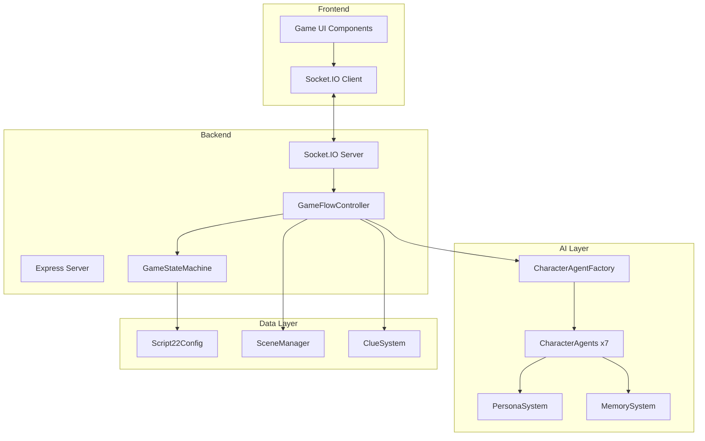

# Design Document: 《第二十二条校规》剧本杀系统

## Overview

本系统是一个AI驱动的7人剧本杀游戏平台，专门为《第二十二条校规》剧本设计。系统采用分层架构，包含角色AI代理、游戏状态机、记忆系统、场景管理和前端界面五大核心模块。

核心技术栈：
- 前端：React + TypeScript + TailwindCSS
- 后端：Node.js + Express + Socket.IO
- AI：LangChain + DeepSeek API
- 测试：Vitest + fast-check (属性测试)

## Architecture



## Components and Interfaces

### 1. Script22Config (数据配置)

```typescript
// src/data/script22/Script22Config.ts
interface Script22Config {
  scriptId: 'school-rule-22';
  title: string;
  characters: Script22Character[];
  scenes: Script22Scene[];
  clues: Script22Clue[];
  phases: GamePhase[];
  timeline: TimelineEvent[];
}

interface Script22Character {
  id: string;
  name: string;
  avatar: string;
  role: 'student' | 'teacher' | 'other';
  gender: 'male' | 'female';
  personality: PersonalityTraits;
  secrets: Secret[];
  relationships: Relationship[];
  forbiddenTopics: string[];
  initialPsychState: PsychologicalState;
}

interface PersonalityTraits {
  openness: number;      // 0-100
  conscientiousness: number;
  extraversion: number;
  agreeableness: number;
  neuroticism: number;
  speechPatterns: string[];
  emotionalTriggers: string[];
}

interface Secret {
  id: string;
  content: string;
  revealCondition?: string;
  severity: 'minor' | 'major' | 'critical';
}

interface Relationship {
  targetId: string;
  type: 'friend' | 'enemy' | 'neutral' | 'romantic' | 'family';
  description: string;
  hiddenFeelings?: string;
}
```

### 2. Script22Personas (角色人格配置)

```typescript
// src/data/script22/Script22Personas.ts
interface Script22Persona {
  characterId: string;
  name: string;
  coreIdentity: string;
  psychologicalProfile: string;
  behaviorPatterns: BehaviorPattern[];
  dialogueStyle: DialogueStyle;
  reactionTemplates: ReactionTemplate[];
}

interface BehaviorPattern {
  trigger: string;
  response: string;
  emotionalShift: Partial<PsychologicalState>;
}

interface DialogueStyle {
  formality: 'casual' | 'formal' | 'mixed';
  verbosity: 'terse' | 'normal' | 'verbose';
  emotionalExpression: 'suppressed' | 'moderate' | 'expressive';
  commonPhrases: string[];
  avoidedWords: string[];
}

// 7个角色的Persona定义
const SCRIPT22_PERSONAS: Record<string, Script22Persona> = {
  'li_xuanxuan': { /* 李萱萱 - 扭曲的依恋 */ },
  'huangfu_qing': { /* 皇甫青 - 自我认知撕裂 */ },
  'yao_qingfeng': { /* 姚青峰 - 恐惧与虚张声势 */ },
  'lv_siqi': { /* 吕思琦 - 虚伪的完美 */ },
  'ye_lengxing': { /* 叶冷星 - 救赎与理智 */ },
  'xie_yuqing': { /* 谢雨晴 - 恶意的操控者 */ },
  'bai_mu': { /* 白穆 - 受害者的沉默 */ },
};
```

### 3. Script22CharacterAgent (AI角色代理)

```typescript
// src/server/script22/Script22CharacterAgent.ts
interface Script22CharacterAgent {
  characterId: string;
  persona: Script22Persona;
  memory: CharacterMemory;
  psychState: PsychologicalState;
  
  // 核心方法
  generateResponse(input: PlayerInput): Promise<AgentResponse>;
  validateResponse(response: string): ValidationResult;
  updatePsychState(event: GameEvent): void;
  getReaction(trigger: string): ReactionResponse;
}

interface CharacterMemory {
  publicMemory: MemoryEntry[];    // 所有人都知道的
  privateMemory: MemoryEntry[];   // 只有自己知道的
  sharedMemory: Map<string, MemoryEntry[]>; // 与特定角色共享的
}

interface PsychologicalState {
  fearLevel: number;        // 0-100
  suspicionLevel: number;   // 0-100
  trustLevels: Map<string, number>;
  currentEmotion: Emotion;
  stressLevel: number;
}

interface ValidationResult {
  isValid: boolean;
  violations: string[];
  suggestedFix?: string;
}
```

### 4. Script22GameFlow (游戏流程控制)

```typescript
// src/server/script22/Script22GameFlow.ts
type GamePhase = 
  | 'INTRO'
  | 'SCRIPT_READING'
  | 'FREE_DISCUSSION'
  | 'CLUE_SEARCH'
  | 'ACCUSATION'
  | 'VOTE'
  | 'REVEAL';

interface Script22GameFlow {
  currentPhase: GamePhase;
  phaseOrder: GamePhase[];
  speakingOrder: string[];
  currentSpeaker: number;
  
  // 流程控制
  advancePhase(): GamePhase;
  nextSpeaker(): string;
  canTransition(toPhase: GamePhase): boolean;
  
  // 事件处理
  handlePlayerAction(action: PlayerAction): Promise<GameEvent[]>;
  triggerAIReactions(event: GameEvent): Promise<AIReaction[]>;
}

interface GameEvent {
  type: 'speech' | 'accusation' | 'clue_reveal' | 'phase_change' | 'vote';
  sourceId: string;
  targetId?: string;
  content: string;
  timestamp: number;
}
```

### 5. SceneManager (场景管理)

```typescript
// src/server/script22/SceneManager.ts
interface Script22Scene {
  id: string;
  name: string;
  description: string;
  atmosphere: 'tense' | 'calm' | 'mysterious' | 'horror';
  backgroundUrl: string;
  bgmUrl?: string;
  interactivePoints: InteractivePoint[];
  hiddenClues: string[];
}

interface InteractivePoint {
  id: string;
  name: string;
  position: { x: number; y: number };
  action: 'investigate' | 'talk' | 'use_item';
  linkedClueId?: string;
}

// 7个主要场景
const SCRIPT22_SCENES: Script22Scene[] = [
  { id: 'classroom', name: '教室', /* ... */ },
  { id: 'rooftop', name: '天台', /* ... */ },
  { id: 'office', name: '办公室', /* ... */ },
  { id: 'restroom', name: '厕所', /* ... */ },
  { id: 'dormitory', name: '宿舍', /* ... */ },
  { id: 'wardrobe', name: '衣柜', /* ... */ },
  { id: 'cardboard_box', name: '纸箱', /* ... */ },
];
```

### 6. ClueSystem (线索系统)

```typescript
// src/server/script22/ClueSystem.ts
interface Script22Clue {
  id: string;
  name: string;
  description: string;
  imageUrl?: string;
  sceneId: string;
  discoveryCondition: DiscoveryCondition;
  relatedCharacters: string[];
  importance: 'low' | 'medium' | 'high' | 'critical';
}

interface DiscoveryCondition {
  type: 'always' | 'phase' | 'character' | 'clue_chain';
  requiredPhase?: GamePhase;
  requiredCharacter?: string;
  requiredClues?: string[];
}

interface ClueSystem {
  allClues: Script22Clue[];
  discoveredClues: Set<string>;
  
  canDiscover(clueId: string, context: GameContext): boolean;
  discoverClue(clueId: string): Script22Clue;
  getCluesForScene(sceneId: string): Script22Clue[];
  getCluesForCharacter(characterId: string): Script22Clue[];
}
```

## Data Models

### Game State Model

```typescript
interface Script22GameState {
  roomId: string;
  scriptId: 'school-rule-22';
  
  // 游戏进度
  currentPhase: GamePhase;
  phaseStartTime: number;
  roundNumber: number;
  
  // 角色状态
  characters: Map<string, CharacterState>;
  speakingOrder: string[];
  currentSpeakerIndex: number;
  
  // 场景状态
  currentSceneId: string;
  visitedScenes: Set<string>;
  
  // 线索状态
  discoveredClues: Set<string>;
  clueOwnership: Map<string, string[]>; // clueId -> characterIds
  
  // 投票状态
  votes: Map<string, string>; // voterId -> targetId
  accusations: Accusation[];
  
  // 对话历史
  conversationHistory: Message[];
}

interface CharacterState {
  characterId: string;
  isAI: boolean;
  playerId?: string;
  psychState: PsychologicalState;
  memory: CharacterMemory;
  hasSpoken: boolean;
}
```

### Message Model

```typescript
interface Script22Message {
  id: string;
  type: 'player' | 'character' | 'narrator' | 'system';
  senderId: string;
  senderName: string;
  content: string;
  emotion?: Emotion;
  timestamp: number;
  metadata?: {
    targetCharacterId?: string;
    clueId?: string;
    sceneId?: string;
    isReaction?: boolean;
  };
}
```

## Correctness Properties

*A property is a characteristic or behavior that should hold true across all valid executions of a system-essentially, a formal statement about what the system should do. Properties serve as the bridge between human-readable specifications and machine-verifiable correctness guarantees.*

### Property 1: Character Initialization Completeness
*For any* character initialization, the resulting CharacterAgent SHALL have all required Persona fields populated (personality traits, secrets, relationships, forbidden topics, and initial psychological state).
**Validates: Requirements 1.1, 5.1**

### Property 2: Persona Constraint Validation
*For any* character response and its associated Persona, the validation function SHALL correctly identify when the response violates forbidden topic constraints or reveals secrets inappropriately.
**Validates: Requirements 1.3, 1.4**

### Property 3: Phase Transition Correctness
*For any* current GamePhase, calling advancePhase() SHALL produce the correct next phase according to the defined sequence: INTRO → SCRIPT_READING → FREE_DISCUSSION → CLUE_SEARCH → ACCUSATION → VOTE → REVEAL.
**Validates: Requirements 2.1, 2.2**

### Property 4: Round-Robin Speaking Order
*For any* FREE_DISCUSSION phase with N characters, the speaking order SHALL cycle through all N characters before repeating, and nextSpeaker() SHALL return characters in the correct sequence.
**Validates: Requirements 2.4**

### Property 5: Vote Calculation Correctness
*For any* set of votes where each voter selects exactly one target, the vote calculation SHALL correctly count votes per target and identify the target(s) with the most votes.
**Validates: Requirements 2.6**

### Property 6: Scene Data Completeness
*For any* scene entry, the SceneManager SHALL return scene data containing all required fields (id, name, description, atmosphere, and interactive points).
**Validates: Requirements 3.1**

### Property 7: Clue Discovery Condition Enforcement
*For any* clue with discovery conditions, the ClueSystem SHALL only allow discovery when all conditions are met, and SHALL prevent discovery when conditions are not met.
**Validates: Requirements 3.2, 3.5**

### Property 8: Clue Panel Consistency
*For any* discovered clue, the clue SHALL appear in the player's clue panel, and the panel SHALL contain exactly the set of discovered clues.
**Validates: Requirements 3.3**

### Property 9: Memory Round-Trip Consistency
*For any* conversation stored in the MemorySystem, querying for that conversation SHALL return the stored content, and the character SHALL be able to reference it in subsequent responses.
**Validates: Requirements 4.1, 4.2**

### Property 10: Shared Memory Propagation
*For any* significant event affecting multiple characters, all affected characters' shared memories SHALL be updated to include the event.
**Validates: Requirements 4.3**

### Property 11: Psychological State Update Correctness
*For any* threatening event or accusation, the affected character's PsychologicalState SHALL update with increased fear level (for threats) or increased suspicion level (for accusations).
**Validates: Requirements 5.3, 5.4**

### Property 12: Personality-Consistent Response Patterns
*For any* character response, the response SHALL match the character's defined dialogue style (formality, verbosity, emotional expression) and avoid words in the avoidedWords list.
**Validates: Requirements 5.5**

### Property 13: Contextual Reaction Generation
*For any* character speech event, other characters' reactions SHALL be contextually relevant to the speech content and consistent with their relationships to the speaker.
**Validates: Requirements 6.1, 6.2**

### Property 14: Clue Reveal Reaction Appropriateness
*For any* publicly revealed clue, characters whose secrets are related to the clue SHALL generate reactions that reflect their involvement without explicitly revealing secrets.
**Validates: Requirements 6.3**

### Property 15: Script Configuration Validation
*For any* ScriptConfig input, the validation function SHALL correctly identify valid configurations (all required fields present, correct types) and reject invalid configurations.
**Validates: Requirements 7.1, 7.2**

### Property 16: Dynamic Agent Creation
*For any* loaded script with N character definitions, the system SHALL create exactly N CharacterAgents, each with the correct Persona configuration.
**Validates: Requirements 7.3**

### Property 17: Game State Serialization Round-Trip
*For any* valid Script22GameState, serializing to JSON and deserializing back SHALL produce an equivalent game state.
**Validates: Requirements 7.5**

### Property 18: Character Card Data Completeness
*For any* character, the character card display SHALL contain all required fields (avatar, name, role, and relationship status with the viewing player).
**Validates: Requirements 8.3**

## Error Handling

### AI Response Errors
- Timeout (>10s): Display fallback response, log error, retry once
- Invalid response: Re-generate with stricter constraints
- API failure: Queue message, notify user, attempt reconnection

### Game State Errors
- Invalid phase transition: Reject and log, maintain current state
- Concurrent modification: Use optimistic locking, resolve conflicts
- Memory corruption: Restore from last checkpoint

### Network Errors
- Socket disconnection: Auto-reconnect with exponential backoff
- Message loss: Implement acknowledgment and retry mechanism

## Testing Strategy

### Unit Testing (Vitest)
- Test individual functions in isolation
- Focus on edge cases and error conditions
- Mock external dependencies (AI API, database)

### Property-Based Testing (fast-check)
- Use fast-check library for property-based tests
- Configure minimum 100 iterations per property test
- Each property test MUST reference the correctness property it implements using format: `**Feature: school-rule-22-game, Property {number}: {property_text}**`

Example property test structure:
```typescript
import { fc } from 'fast-check';
import { describe, it, expect } from 'vitest';

describe('Script22GameFlow', () => {
  // **Feature: school-rule-22-game, Property 3: Phase Transition Correctness**
  it('should transition phases in correct sequence', () => {
    fc.assert(
      fc.property(
        fc.constantFrom('INTRO', 'SCRIPT_READING', 'FREE_DISCUSSION', 'CLUE_SEARCH', 'ACCUSATION', 'VOTE'),
        (currentPhase) => {
          const gameFlow = new Script22GameFlow(currentPhase);
          const nextPhase = gameFlow.advancePhase();
          return nextPhase === EXPECTED_NEXT_PHASE[currentPhase];
        }
      ),
      { numRuns: 100 }
    );
  });
});
```

### Integration Testing
- Test component interactions
- Verify Socket.IO event handling
- Test full game flow scenarios

### Test Coverage Goals
- Unit tests: 80% code coverage
- Property tests: All 18 correctness properties
- Integration tests: Critical user flows
